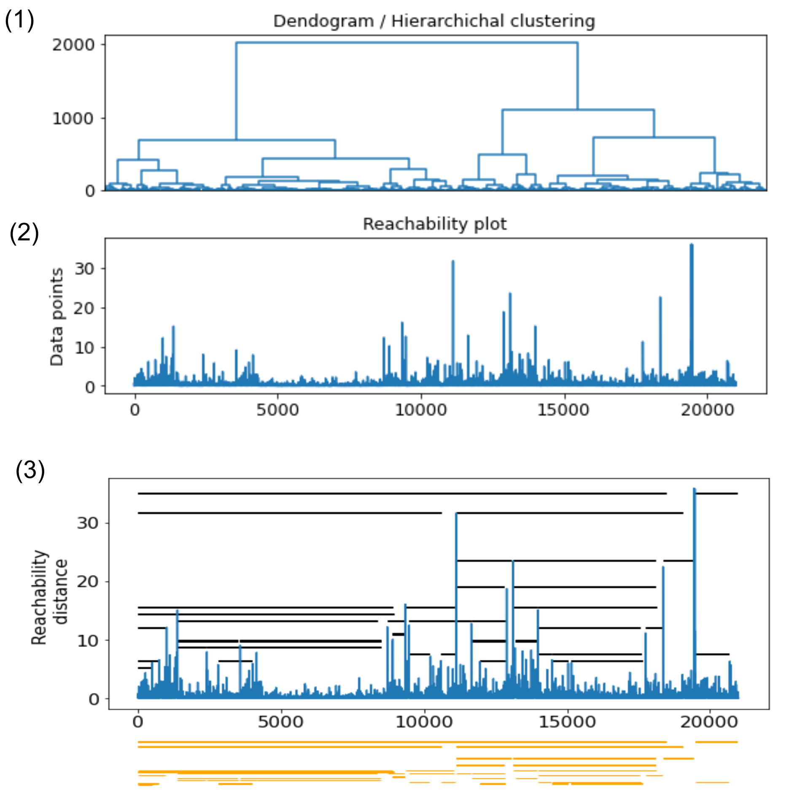

* The instruction file needs modification. Will be done soon
# Revised hierarchical clustering (RHCC)
## Objective 
This tool is an improved version of the hierarchical clustering algorithm, renamed **revised hierarchical clustering** or **RHCC**.<br>
It aims to cluster biomolecules (proteins) sharing structure similarities.

## Summary
The RHCC is an automated clustering algorithm, that computes a hierarchical representation and transform this latter into a reachability plot.
From the reachability plot, the data are splitted into clusters by a horizontal cut-off delimitation. 
This cut-off delimitaion is progressing in the depth of the recheability plot, to refine the clusters.
Deep learning algorithm have been intergated in the tool, aiming to optimize the cut-off distance defining the clusters.

## More details
The general idea was inspired from the paper work of Sander and collaborators : DOI:10.1007/3-540-36175-8_8.
The RHCC merge the concept of the hierarchical clustering algorithm and density based clustering OPTCS.

The motivation behind the development of RHCC emerged from the difficulty of reading a dendogram, and defining optimum hyperparameters of OPTIC with large data set.

The basic hierarchical clustering algorithm (HCC) computes the distance between two groups and merge them according to their similarity until forming a single large group.
Thus, the algorithm yield to a hierarchical representation of the data points known as a dendogram.
The HCC does not define explicitely the final (optimum) clusters of the data -- the users have to define a horizontal cutoff through the dendogram.
This horizontal cutoff is defined by visual inspection.

OPTICS is a density-based algorithm that computes the shortest distance (reachability distance) "walk" from one point to its neighbor. It requires two parameters, $\epsilon$ and Minpoints.
For a very large data, the time execution of the algorithm increase significantly.
The projection of the reachability distance results to a reachability plot where potential clusters are indicated by "dents". 

Protocols of the RHCC :<br>
(1) The RHCC computes a hierarchical clustering, which yield into a dendogram. <br>
The dendogram heights between two consecutive singleton cluster (from the left to the the right) are stored, they correspond to reachability distances.<br>
(2) The projection of the reachability distances give a reachability plot.<br>
(3) From the top to the bottom of the dendogram, at separable dents, clusters are splitted into finer child(ren) cluster(s), i.e into more homogenous clusters.<br>



## Installation
Please dowload the file **revised_huclust.py** into a directory.
Add the following command to your .bashrc : <br>
`export PYTHONPATH=$PYTHONPATH:/path_to_directory/`

## Usage
This module can be executed in IDEs such as Jupyter Notebook. After installation, import the module into Jupyter Notebook: <br>
`import revised_hclust as r_clust`

To perform the clustering, execute the command :<br>
`r_clust.deep_rhcc(pdb, traj, feat, cutoff_min, min_number_data, outcomb)`<br>
If you would like to generate trajectory files of the clusters, add return_xtc_file=True, as following :<br>
`r_clust.deep_rhcc(pdb, traj, feat, cutoff_min, min_number_data, outcomb, return_xtc_file=True )`<br>

where : <br>
- pdb : absolute path to the PDB file
- traj : absolute path to the trajectory file
- features : atoms selection using mdAnalysis syntax (e.g. : "protein and name CA")
- cutoff_min (int, float) :  define maximal distance value between two points to be considered similar
- min_number_data : define the minimum number of points to be considered as clusters
- outcomb : absolute path to write the trajectory files for the clustered points <br>

e.g. : <br>
```
pdb  = "/path/to/directory/file.pdb"
traj = "/path/to/directory/file.xtc"
features   = "protein and name CA"
cutoff_min = 5.5
min_number_data = 400 
outcomb = "/path/to/directory/" 
r_clust.deep_rhcc(pdb, traj, feat, cutoff_min, min_number_data, outcomb)
```
OUTPUTS : <br>
This will display the explored iteration steps (default : iteration=20) and the sum squared error generated at each iteration, with the actual optimized value of the cutoff.
To disable this, set `show_steps=False`<br>
A figure of the reachability plot will be generated as default.<br>
If you would like to generate analysis figures of boxplot and number of data within each cluster, set `return_boxplot=True`.<br>

Alternatively,  to perform RHCC without optimizing the giving cutoff: <br>
```r_clust.single_rhc(pdb, traj, feat, cutoff_min, min_number_data, outcomb)<br>
```
To display the description, input(s) and output(s) the function, execute `r_clust.deep_rhcc?`


